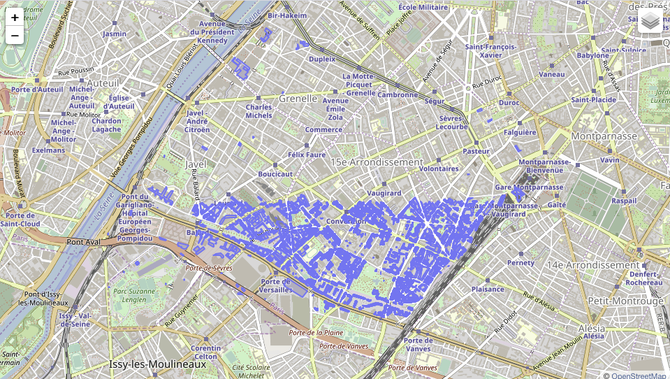
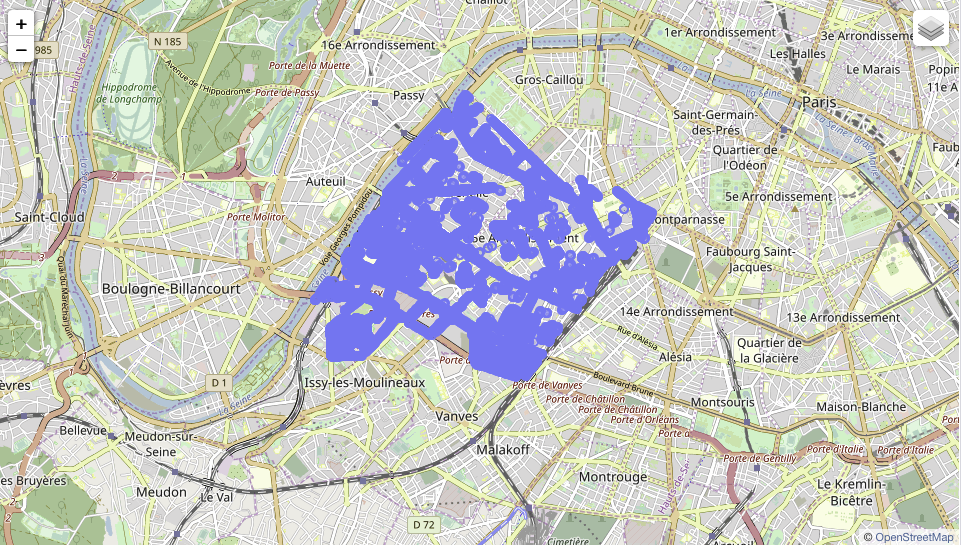
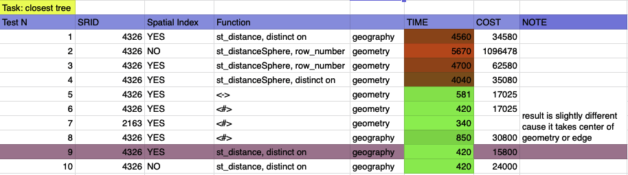
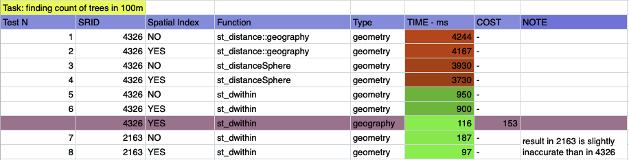
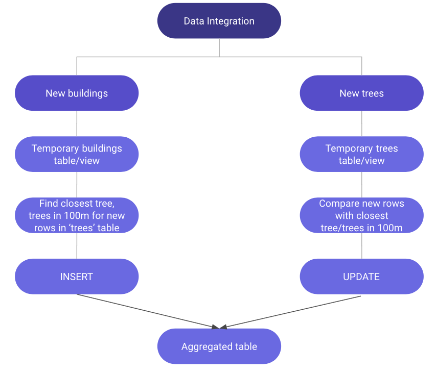

# Database

My first choice was MongoDB, since it would be fast and horizontal scalable.
But found out that MongoDB has not necessary features and functions to calculate distance between different geometries.
Then choice laid on PostGIS, since it has all the necessary tools, except some issues while dealing with big amounts of data, which will be covered through this report.

# Data Ingestion

If it is single import of data to PostGIS, we can easily upload through PgAdmin GUI, or with single line of code.
Nevertheless, I designed Python code for both import style upload or batch style upload.

# Data Visualization

### Data cleaning
Since all the data in dataset was pretty clear, I just made PostGIS validation with st_MakeValid.
The function which attempts to create a valid representation of a given invalid geometry without losing any of the input vertices.

```sql
UPDATE buildings
SET location=ST_MakeValid(location);

UPDATE trees
SET location=ST_MakeValid(location);
```

### Data Visualization


I was not reinventing the wheel and used PgAdmin's GUI tools to visualize data


```python
from IPython.display import Image
Image("/Users/meirkhan/Desktop/buildings.png")
```





```python
Image("/Users/meirkhan/Desktop/trees.png")
```





## Finding closest tree
```SQL
WITH 
cte as (
        SELECT 
          distinct on (b.id)  b.id building_id,
          t.id tree_id
        FROM buildings as b,
             treees as t
        ORDER BY b.id, 
                 St_distance(b.location::geometry, t.location::geometry)
       )
SELECT 
  cte.building_id,
  cte.tree_id,
  St_distance(b.location, t.location)
FROM cte, 
     buildings b, 
     trees t
WHERE b.id = cte.building_id
  AND t.id = cte.tree_id;
```


```python
Image("/Users/meirkhan/Desktop/1st.png")
# 
```





## Finding count of trees in 100 m
```SQL
SELECT b.id, 
      (CASE WHEN x.cnt is NULL THEN 0 ELSE x.cnt END) cnt
FROM buildings b 
LEFT JOIN
      (
        SELECT b.id building_id, count(b.id) cnt 
        FROM buildings b, 
             trees t
        WHERE st_dwithin(b.location::geography, t.location::geography, 100)
        GROUP BY b.id
      ) x
ON b.id = x.building_id;
```


```python
from IPython.display import Image
Image("/Users/meirkhan/Desktop/2nd.png")
```





As we infer from both tables, best performance is obtained when operating with **spatial indexes, geography datatype
and SRID:2163** (US National Atlas Equal Area). 

Even though it is fastest SRID recommended by many sources, it's results are not that accurate. 
I assumed in this task accuracy is very important, therefore I used only **SRID:4326** on final results.

## Aggregated table
On whole dataset this query performs in nearly 5 minutes

```SQL
CREATE aggregated_table AS ( 
WITH 
cte1 AS 
        ( 
          SELECT DISTINCT ON (b.id) b.id building_id, 
          t.id tree_id 
          FROM buildings b, 
               trees     t 
          ORDER BY b.id, 
                   st_distance(b.location::geometry, t.location::geometry) 
        ), 
cte2 AS
        ( 
          SELECT b.id, ( 
                    CASE 
                      WHEN x.cnt IS NULL 
                      THEN 0 
                      ELSE x.cnt 
                    END) cnt 
          FROM      buildings1 b 
          LEFT JOIN 
                    ( 
                      SELECT   b.id building_id, 
                               count(b.id) cnt 
                      FROM  buildings b, 
                            trees t 
                      WHERE st_dwithin(b.location::geography, t.location::geography, 100)
                      GROUP BY b.id
                    ) x 
          ON b.id = x.building_id 
        )
SELECT cte1.building_id, 
       cte1.tree_id, 
       St_distance(b.location, t.location) dist, 
       cte2.cnt 
FROM   cte1, 
       cte2, 
       buildings1 b, 
       trees1 t 
WHERE  b.id = cte1.building_id 
AND    t.id = cte1.tree_id 
AND    cte1.building_id=cte2.id);
```

## Pipeline for Data Integration


```python
Image("/Users/meirkhan/Desktop/pipe.png")
```





As one option to integration of newly arrived data, we can define two stored procedures, for "buildings" and "trees" respectively.

- So that, new buildings data would be stored in temporary table, stored procedure would calculate nearest tree for them, count of trees in 100m and insert it to aggregated table. Stored procedure is as below:


```SQL

CREATE OR REPLACE PROCEDURE updateBuildings()
LANGUAGE plpgsql    
AS $$
BEGIN
    INSERT INTO aggregated_table(building_id, tree_id, dist, cnt,b_loc,t_loc) 
WITH
cte1 as (
		 SELECT 
			distinct on (b.id)  b.id building_id,
			t.id tree_id,
			b.location b_loc,
			t.location t_loc
		FROM temp_buildings as b,
	 		 trees as t
		ORDER BY b.id, St_distance(b.location::geometry, t.location::geometry)  
		),	
cte2 as (
	 	SELECT b.id, (case when x.cnt is null then 0 else x.cnt end) cnt
		FROM b1 b LEFT JOIN
		(
			select b.id , count(b.id) cnt from
			temp_buildings b, 
			trees t
			WHERE st_dwithin(b.location::geography, t.location::geography, 100)
			GROUP BY b.id
		) x
		ON b.id = x.id
)
 
SELECT 
	cte1.building_id,
	cte1.tree_id,
	St_distance(b.location, t.location) dist,
	cte2.cnt,
	cte1.b_loc,
	cte1.t_loc
FROM cte1, 
	  temp_buildings b, 
	  trees t, 
	  cte2	  
WHERE b.id = cte1.building_id
  AND t.id = cte1.tree_id
  AND cte1.building_id=cte2.id;
 
    COMMIT;
END;
$$;


call updateBuildings();


```

Respectively, as new trees data arrives, it will be stored in temporary table, and unlike buildings data, stored procedure 
would be performing UPDATES instead of INSERTS. 
So that, it will be calculated with joins on buildings table and respective row in AGGREGATED table and  
- Tree id and distance will be updated if tree is closer than old one
- Count of trees in 100m radius will increment by 1, if tree lays in that radius

CODE:

```SQL
CREATE OR REPLACE PROCEDURE updateTrees()
LANGUAGE plpgsql
AS $$
DECLARE
	r1 record;
	r2 record;
	new_dist float;
	isInRadius boolean;
BEGIN
	FOR r1 IN select * from aggregated_table
	LOOP
		FOR r2 IN SELECT * from temp_tree_table
		LOOP
			IF st_distance(r1.b_loc::geography,r2.location::geography) < r1.dist then
				new_dist := st_distance(r1.b_loc::geography,r2.location::geography);				
			END IF;
			IF st_dwithin(r1.b_loc::geography, r2.location::geography, 100) then
				isInRadius := true;
			END IF;
		END LOOP;
		UPDATE aggregated_table 
      	SET dist = new_dist 
    	WHERE r1.building_id = r2.id;
		IF isInRadius = true then
			UPDATE aggregated_table 
	      	SET cnt = 1111 
    		WHERE r1.building_id = r2.id;
		END IF;
	END LOOP;
    COMMIT;
END;
$$;

call updateTrees();
```

Other than that, it is clear that we cannot handle big amount of data by only user side tricks like index algorithms.
Hence, I would suggest implementing some server side improvements, like parallelism and try to implement column store database.

And after some research, I found out that it is possible scale Postgres horizontally with **Citus.**
Citus solves the horizontal partitioning problem in a clever way.
Citus realized if they made far more logical partitions of tables than physical nodes, they could
- put copies of partitions on multiple physical nodes for redundancy, so losing one node never caused data loss, and
- rebalance to new nodes by moving logical partitions automatically between nodes, which is far easier to automate than moving rows between nodes.
